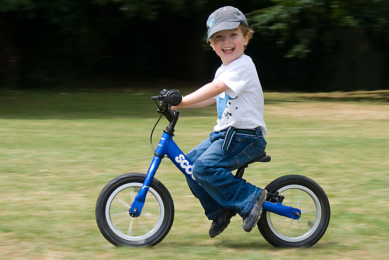

## Обзор беговела Ridgeback Scoot (Англия) ##

>Представляем вашему вниманию беговел Ridgeback Scoot. Британская фирма Ridgeback новички на российском рынке, несмотря на то, что они широко известны в Европе. Свою популярность они завоевали благодаря умеренной ценовой политике и, конечно же, приятному дизайну.

Представляем вашему вниманию беговел Ridgeback Scoot. Британская фирма Ridgeback новички на российском рынке, несмотря на то, что они широко известны в Европе. Свою популярность они завоевали благодаря умеренной ценовой политике и, конечно же, приятному дизайну.

Простой, и в то же время, элегантный дизайн беговела Scoot притягивает взгляды. Красиво изогнутая рама без острых углов, что очень важно для безопасности, корпус окрашен в единый цвет (плюс, контрастный логотип модели белый/черный на изгибе рамы). Сиденье, колеса и руль выполнены в черном цвете.

Несомненное преимущество Scoot – это разнообразие цветов. Можно выбрать как классический вариант - розовый для девочки, синий для мальчика, либо строгий, «деловой» вариант – серебристый и темно серебристый, а беспокойным родителям приглянутся яркие варианты – зеленый, оранжевый, фиолетовый, ребенка на таком велосипеде потерять из виду будет очень сложно.

А теперь более подробно.

Ridgeback Scoot:

* пневматические шины 12,5”
* регулируемый по высоте руль - 3 см
* регулировка высоты сиденья 16 см (от 35 до 50 см)
* тормоз заднего колеса типа V-brake
* вес около 5,1 кг

Такой диапазон регулировки сиденья возможен благодаря двум сменным подседельным штырям. Когда Ваш малыш подрастет, Вам достаточно будет поменять штырь на более высокий и отрегулировать руль.

Качество продукта Ridgeback, подтверждено сертификатами и проверено многими малышами Европы. Каким бы активным ни был Ваш малыш – Scoot выдержит! Вы сами можете убедиться, насколько прочно скреплены детали беговела (см. фото). Что касается неметаллических частей, то в них тоже сомневаться не приходиться. Безопасные ручки-гармошки выполнены из высококачественной резины и прослужат довольно долго. Очень удобное, мягкое сиденье из искусственной кожи обеспечит максимальный комфорт при многочасовых тренировках. Тормоз нажимается плавно, без рывков, что очень важно для молодых водителей.
Недорогой, качественный, красивый, удобный и это все - Ridgeback Scoot.

